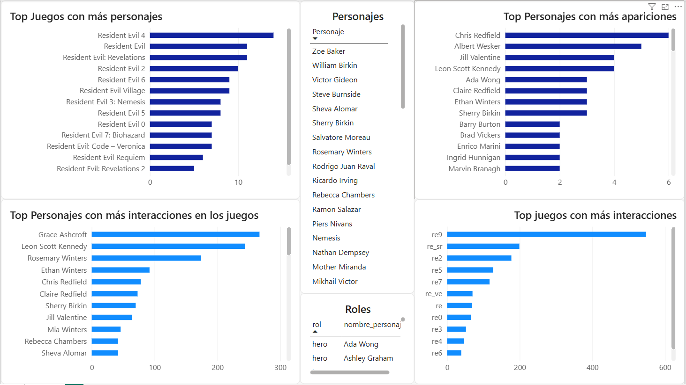

# Primer proyecto como analista de datos

Este primer proyecto representa mi transición hacia el Data Analytics, procesando datos en python y visualización avanzada en Power BI.

# Objetivo

El objetivo principal es desglosar la complejidad narrativa e la saga de videojuegos "Resident Evil" para identificar patrones de aparición, roles y niveles de interacción de sus personajes.

# Pipeline de datos

Para este proyecto realicé la limpieza y transformación de archivos CSV crudos (raw data) mediante scripts en python, asegurando los datos antes de su visualización.

# Herramientas y Métodos de Pandas utilizados

- pd.read_csv():
  Métdo para importar los archivos crudos (raw) y convertirlos en DataFrames manipulables.

- pd.merge():
  Se utiliza para cruzar diferentes tablas relacionales basandonos en llaves comunes como IDs, funcionando como el equivalente directo a un "LEFT JOIN" en SQL.

- .drop():
  Utilizado en la limpieza de datos para eliminar series (columnas) redundantes que se generaron tras desnormalizar las tablas.

- .rename():
  Esencial para las buenas practicas de presentación. Se usa para limpiar los sufijos automaticos y darle a las columnas nombres descriptivos orientados al negocio.

- .value_counts():
  Función analítica que agrupa y cuenta frecuencias automaticamente; Equivalente directo a un "GROUP BY" + "COUNT" en SQL, ideal para generar rankings rápidos.

- .groupby():
  Método avanzado para agrupar datos por categorías(ej. agrupar por título de juego) y aplicar funciones de agregación.

# Preguntas de Negocio

- Pregunta 1: ¿Qué personajes tiene más apariciones en toda la saga?
- Pregunta 2: ¿Qué juego tiene la mayor cantidad de personajes en este dataset?
- Pregunta 3: ¿Cuál es la cronología de lanzamiento de todos los juegos de RE?
- Pregunta 4: ¿Qué juegos contienen más escenas? #Falta por visualizar
- Pregunta 5: ¿Qué personajes tienen más interacciones?
- Pregunta 6: ¿En qué escenas se realizan más interacciones?
